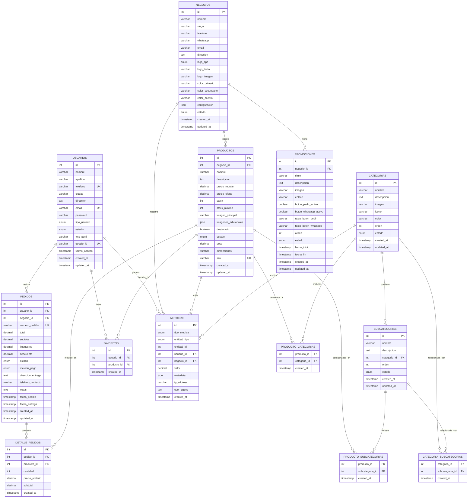

# 🗄️ Diagrama del MER - Sistema de Catálogo Multi-Negocio

## 📊 Diagrama de Entidad-Relación



## 🔗 **Descripción de Relaciones**

### **Relaciones 1:N (Uno a Muchos)**
- **USUARIOS → PEDIDOS**: Un usuario puede tener múltiples pedidos
- **NEGOCIOS → PRODUCTOS**: Un negocio puede tener múltiples productos
- **NEGOCIOS → PROMOCIONES**: Un negocio puede tener múltiples promociones
- **PEDIDOS → DETALLE_PEDIDOS**: Un pedido puede tener múltiples detalles
- **PRODUCTOS → DETALLE_PEDIDOS**: Un producto puede estar en múltiples detalles
- **CATEGORIAS → SUBCATEGORIAS**: Una categoría puede tener múltiples subcategorías

### **Relaciones N:M (Muchos a Muchos)**
- **USUARIOS ↔ PRODUCTOS** (FAVORITOS): Un usuario puede tener múltiples favoritos, un producto puede ser favorito de múltiples usuarios
- **PRODUCTOS ↔ CATEGORIAS**: Un producto puede pertenecer a múltiples categorías, una categoría puede tener múltiples productos
- **PRODUCTOS ↔ SUBCATEGORIAS**: Un producto puede estar en múltiples subcategorías, una subcategoría puede tener múltiples productos
- **CATEGORIAS ↔ SUBCATEGORIAS**: Una categoría puede estar relacionada con múltiples subcategorías, una subcategoría puede estar relacionada con múltiples categorías

### **Relaciones de Métricas**
- **USUARIOS → METRICAS**: Un usuario puede generar múltiples métricas
- **NEGOCIOS → METRICAS**: Un negocio puede registrar múltiples métricas
- **PRODUCTOS → METRICAS**: Un producto puede tener múltiples métricas
- **CATEGORIAS → METRICAS**: Una categoría puede tener múltiples métricas

## 📊 **Cardinalidades**

| Entidad A | Relación | Entidad B | Cardinalidad |
|-----------|----------|-----------|--------------|
| USUARIOS | realiza | PEDIDOS | 1:N |
| NEGOCIOS | posee | PRODUCTOS | 1:N |
| NEGOCIOS | tiene | PROMOCIONES | 1:N |
| PEDIDOS | contiene | DETALLE_PEDIDOS | 1:N |
| PRODUCTOS | incluido_en | DETALLE_PEDIDOS | 1:N |
| CATEGORIAS | contiene | SUBCATEGORIAS | 1:N |
| USUARIOS | tiene | FAVORITOS | 1:N |
| PRODUCTOS | favorito_de | FAVORITOS | 1:N |
| PRODUCTOS | pertenece_a | CATEGORIAS | N:M |
| PRODUCTOS | categorizado_en | SUBCATEGORIAS | N:M |
| CATEGORIAS | relacionada_con | SUBCATEGORIAS | N:M |

## 🎯 **Flujo de Datos Principal**

```
USUARIO → PEDIDO → DETALLE_PEDIDOS → PRODUCTOS
    ↓
FAVORITOS → PRODUCTOS
    ↓
METRICAS (registra interacciones)
```

## 🏪 **Flujo Multi-Negocio**

```
NEGOCIO → PRODUCTOS → CATEGORIAS/SUBCATEGORIAS
    ↓
PROMOCIONES (hero slider)
    ↓
PEDIDOS (de usuarios)
```

---

*Diagrama creado para el Sistema de Catálogo Multi-Negocio MVP*
*Versión: 1.0 | Fecha: $(date)*
